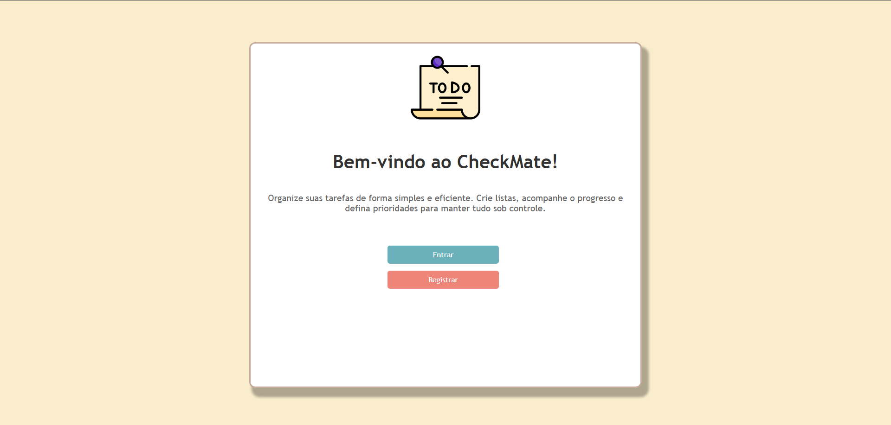
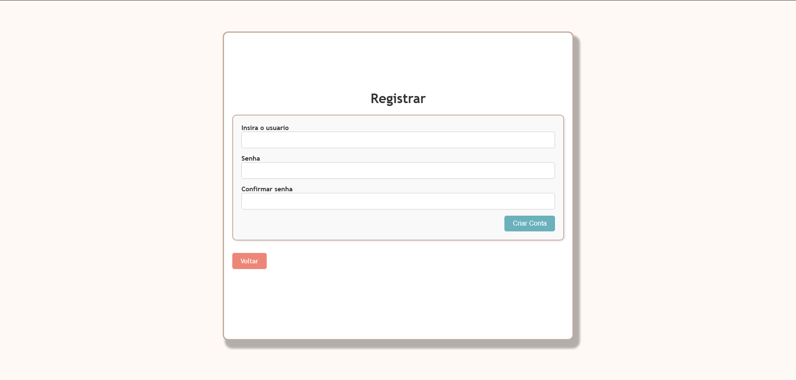

# TO DO LIST


## Sumário
- 🌍 [Visão Geral](#🌍-visão-geral)
- ✨ [Principais Funcionalidades](#✨-principais-funcionalidades)
- 🏗️ [Arquitetura](#🏗️-arquitetura)
- 🛤️ [Rotas](#🛤️-rotas)
- 📝 [Padrão de Commit](#📝-padrão-de-commit)
- 🛠️ [Stacks Utilizadas](#🛠️-stacks-utilizadas)
- 📋 [Pré-requisitos](#📋-pré-requisitos)
- 💻 [Como Rodar Localmente](#💻-como-rodar-localmente)
- 🐳 [Como rodar utilizando docker](#🐳-como-rodar-utilizando-docker)
- 🐘 [Como rodar utilizando postgres ao inves de sqlite](#🐘-como-rodar-utilizando-postgres-ao-inves-de-sqlite)
- ✅ [Executar os Testes](#✅-executar-os-testes)
- 🎥 [Demonstração](#🎥-demonstração)

# 🌍-Visão geral
A aplicação ToDoList foi criada sendo a solução do case técnico da vaga de estágio da V360, permite ao usuário criar, visualizar e gerenciar suas tarefas organizadas em listas de tarefas. Cada tarefa pode ser classificada por prioridade, e as listas podem ser visualizadas de maneira organizada, proporcionando uma interface simples e intuitiva para controle de tarefas diárias.


# ✨-Principais funcionalidades
- Realizar de registro, login e logout de usuários;
- Usuários podem criar, atualizar e apagar listas;
- Usuários podem criar, atualizar e apagar itens dentro das listas;
- Usuários podem classificar os itens dentre uma de 3 prioridades (Baixa, Média e Alta);
- As listas de itens são ordenadas levando em conta as prioridade definidas na criação do item;
- Cada item receberá a cor da sua prioridade;

# 🏗️ Arquitetura
O projeto segue o padrão MVC (Model-View-Controller), que organiza o código em três camadas principais:

- Model: Gerencia a lógica de negócios e a interação com o banco de dados. Exemplos:

    - ```User```: Representa os usuários.
    - ```TodoList```: Representa as listas de tarefas.
    - ```TodoItem```: Representa os itens das listas.`

- View: Responsável pela interface do usuário. Exemplos:

    - ```todo_lists/index.html.erb```: Exibe todas as listas de tarefas.
    - ```sessions/new.html.erb```: Formulário de login.

- Controller: Processa as requisições, interage com os modelos e renderiza as views. Exemplos:

    - ```TodoListsController```: Gerencia as ações relacionadas às listas de tarefas.
    - ```SessionsController```: Gerencia login e logout.

# 🛤️ Rotas
| Caminho                                                | Verbo HTTP | Controller#Action       | Descrição                |
| ------------------------------------------------------ | ---------- | ----------------------- | ------------------------ |
| `/signup`                                              | GET        | `Users#new`             | Formulário de cadastro   |
| `/signup`                                              | POST       | `Users#create`          | Criação de novo usuário  |
| `/login`                                               | GET        | `Sessions#new`          | Formulário de login      |
| `/login`                                               | POST       | `Sessions#create`       | Autentica usuário        |
| `/logout`                                              | DELETE     | `Sessions#destroy`      | Logout                   |
| `/todo_lists`                                          | GET        | `TodoLists#index`       | Lista todas as listas    |
| `/todo_lists/:id`                                      | GET        | `TodoLists#show`        | Detalhes da lista        |
| `/todo_lists/:todo_list_id/todo_items/:id/toggle_done` | PATCH      | `TodoItems#toggle_done` | Alterna status da tarefa |

# 📝 Padrão de Commit
- O projeto segue um padrão para as mensagens de commit, com o objetivo de manter o histórico do repositório organizado e fácil de entender. Utilize o seguinte formato:

- Estrutura da mensagem:
```bash
 git commit -m "Se aplicado, este commit [descreve claramente o que foi feito]."
```

Exemplos:

- Adiciona funcionalidade de login para usuários.
- Corrige bug na exibição de itens na lista de tarefas.
- Remove código obsoleto do controlador de sessões.


# 🛠️ Stacks utilizadas
- Ruby on rails
- SQLite
- Minitest
- HTML
- CSS

# 📋 Pré-requisitos
- Ruby 3.2.0 ou superior
- Rails 7.1.0 ou superior
- SQLite3
- Git

# 💻 Como rodar localmente:

1. Clone o repositório:  
    ```
    git clone https://github.com/guigutox/ToDoList_V360.git
    ```

2. Entre no diretório que foi criado:
    ```
    cd ToDoList_v360
    ```

3. Instalar as dependencias:
    ```
    bundle install
    ```

4. Criar o banco de dados SQLITE
    ```
    bin/rails db:setup
    ```

5. Rodar a aplicação:
    ```
    bin/rails server
    ```

# 🐳 Como rodar utilizando docker

1. É necessário ter o docker instalado na maquina

2. Entre no diretório do projeto

3. Construa a imagem Docker a partir do `Dockerfile`:
    ```
    docker build -t app-ruby .
    ```

4. Rode o container com a imagem criada:
    ```
    docker run -e SECRET_KEY_BASE=dummy_key -e RAILS_ENV=development -p 3000:3000 --name minha-app-container app-ruby
    ```

5. Acesse a partir da url: http://localhost:3000

# 🐘 Como rodar utilizando postgres ao inves de sqlite

1. Entre no projeto

2. Mude de branch para a branch postgress, utilizando:
    ``` 
    git checkout postgress
    ```

3. Estando na branch utilize o comando no terminal:

    No Windows:
    ```copy .env.example .env```

    No linux e macOs:
    ```cp .env.example .env```

4. Entre no arquivo .env e mude as variáveis

5. Agora é necessario instalar a gem do postgress, no terminal use:

    ```
    bundle install
    ```

6. Agora vamos buildar o container docker, no terminal use:
    ```
    docker compose build
    ```

7. Suba o container utilizando o comando no terminal:
    ```
    docker compose up -d
    ```

8. Utilize o migrate para criar as tabelas dentro do postgres:
    ```
    rails db:create db:migrate
    ```

9. Agora, basta utilizar o comando abaixo para subir a aplicação e agora estará funcionando com postgres:

    ```
    bin/rails server
    ```


# ✅ Executar os testes
1. Abra o terminal

2. Entre no diretório do projeto

3. Rode o seguinte comando:
    ```
    bin/rails test
    ```

# 🎥 Demonstração





