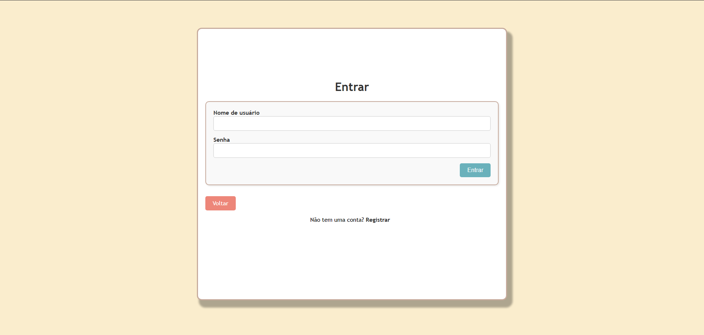
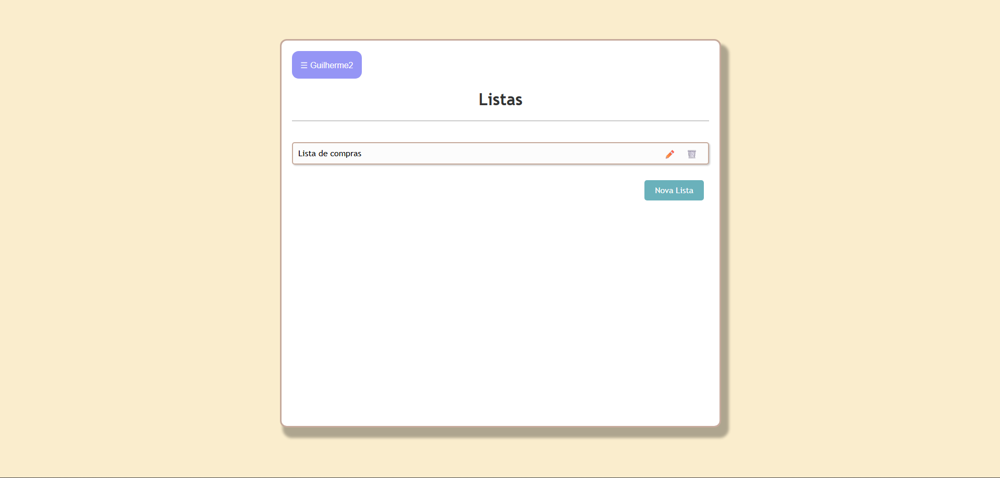

# TO DO LIST


## Sumário
- [Visão Geral](#visão-geral)
- [Principais Funcionalidades](#principais-funcionalidades)
- [Arquitetura](#arquitetura)
- [Estrutura do Projeto](#estrutura-do-projeto)
- [Rotas](#rotas)
- [Padrão de Commit](#padrão-de-commit)
- [Stacks Utilizadas](#stacks-utilizadas)
- [Pré-requisitos](#pré-requisitos)
- [Como Rodar Localmente](#como-rodar-localmente)
- [Executar os Testes](#executar-os-testes)
- [Demonstração](#demonstração)

# Visão geral
A aplicação ToDoList foi criada sendo a solução do case técnico da vaga de estágio da V360, permite ao usuário criar, visualizar e gerenciar suas tarefas organizadas em listas de tarefas. Cada tarefa pode ser classificada por prioridade, e as listas podem ser visualizadas de maneira organizada, proporcionando uma interface simples e intuitiva para controle de tarefas diárias.


## Principais funcionalidades
- Realizar de registro, login e logout de usuários;
- Usuários podem criar, atualizar e apagar listas;
- Usuários podem criar, atualizar e apagar itens dentro das listas;
- Usuários podem classificar os itens dentre uma de 3 prioridades (Baixa, Média e Alta);
- As listas de itens são ordenadas levando em conta as prioridade definidas na criação do item;
- Cada item receberá a cor da sua prioridade;

## Arquitetura
O projeto segue o padrão MVC (Model-View-Controller), que organiza o código em três camadas principais:

- Model: Gerencia a lógica de negócios e a interação com o banco de dados. Exemplos:

    - ```User```: Representa os usuários.
    - ```TodoList```: Representa as listas de tarefas.
    - ```TodoItem```: Representa os itens das listas.`

- View: Responsável pela interface do usuário. Exemplos:

    - ```todo_lists/index.html.erb```: Exibe todas as listas de tarefas.
    - ```sessions/new.html.erb```: Formulário de login.

- Controller: Processa as requisições, interage com os modelos e renderiza as views. Exemplos:

    - ```TodoListsController```: Gerencia as ações relacionadas às listas de tarefas.
    - ```SessionsController```: Gerencia login e logout.

## Estrutura do projeto
Abaixo está a estrutura principal do projeto e uma breve descrição de cada diretório/arquivo:

````markdown
ToDoList/
├── app/
│   ├── assets/                # Arquivos estáticos (CSS, JavaScript, imagens)
│   │   ├── config/            # Configuração do pipeline de assets
│   │   ├── images/            # Imagens usadas na aplicação
│   │   ├── javascripts/       # Arquivos JavaScript personalizados
│   │   └── stylesheets/       # Arquivos CSS personalizados
│   ├── controllers/           # Controladores da aplicação (lógica de rotas)
│   │   ├── todo_lists_controller.rb  # Controlador para listas de tarefas
│   │   ├── todo_items_controller.rb  # Controlador para itens das listas
│   │   └── sessions_controller.rb   # Controlador para login/logout
│   ├── models/                # Modelos da aplicação (lógica de dados)
│   │   ├── user.rb            # Modelo para usuários
│   │   ├── todo_list.rb       # Modelo para listas de tarefas
│   │   └── todo_item.rb       # Modelo para itens das listas
│   ├── views/                 # Views da aplicação (HTML renderizado)
│   │   ├── layouts/           # Layouts compartilhados entre as views
│   │   ├── todo_lists/        # Views relacionadas às listas de tarefas
│   │   ├── todo_items/        # Views relacionadas aos itens das listas
│   │   └── sessions/          # Views relacionadas ao login/logout
│   └── helpers/               # Helpers para views
├── bin/                       # Scripts executáveis (ex.: iniciar o servidor)
├── config/                    # Configurações da aplicação e rotas
│   ├── routes.rb              # Arquivo de rotas da aplicação
│   └── locales/               # Arquivos de tradução (ex.: pt-BR.yml)
├── db/                        # Arquivos relacionados ao banco de dados
│   ├── migrate/               # Arquivos de migração do banco de dados
│   └── schema.rb              # Estrutura atual do banco de dados
├── test/                      # Testes automatizados
│   ├── controllers/           # Testes para os controladores
│   ├── models/                # Testes para os modelos
│   └── fixtures/              # Dados de exemplo para os testes
├── Gemfile                    # Lista de dependências do projeto
├── Gemfile.lock               # Versões exatas das dependências instaladas
├── README.md                  # Documentação do projeto
└── config.ru                  # Arquivo de configuração para o Rack
````

## Rotas
| Caminho                                                | Verbo HTTP | Controller#Action       | Descrição                |
| ------------------------------------------------------ | ---------- | ----------------------- | ------------------------ |
| `/signup`                                              | GET        | `Users#new`             | Formulário de cadastro   |
| `/signup`                                              | POST       | `Users#create`          | Criação de novo usuário  |
| `/login`                                               | GET        | `Sessions#new`          | Formulário de login      |
| `/login`                                               | POST       | `Sessions#create`       | Autentica usuário        |
| `/logout`                                              | DELETE     | `Sessions#destroy`      | Logout                   |
| `/todo_lists`                                          | GET        | `TodoLists#index`       | Lista todas as listas    |
| `/todo_lists/:id`                                      | GET        | `TodoLists#show`        | Detalhes da lista        |
| `/todo_lists/:todo_list_id/todo_items/:id/toggle_done` | PATCH      | `TodoItems#toggle_done` | Alterna status da tarefa |

## Padrão de Commit
- O projeto segue um padrão para as mensagens de commit, com o objetivo de manter o histórico do repositório organizado e fácil de entender. Utilize o seguinte formato:

- Estrutura da mensagem:
```bash
 git commit -m "Se aplicado, este commit [descreve claramente o que foi feito]."
```

Exemplos:

- Adiciona funcionalidade de login para usuários.
- Corrige bug na exibição de itens na lista de tarefas.
- Remove código obsoleto do controlador de sessões.


## Stacks utilizadas
- Ruby on rails
- SQLite
- Minitest
- HTML
- CSS

## Pré-requisitos
- Ruby 3.2.0 ou superior
- Rails 7.1.0 ou superior
- SQLite3
- Git

## Como rodar localmente:

1- Clone o repositório:  
```
git clone https://github.com/guigutox/ToDoList_V360.git
```

2- Entre no diretório que foi criado:
```
cd ToDoList_v360
```

3- Instalar as dependencias:
```
bundle install
```

4- Criar o banco de dados SQLITE
```
bin/rails db:setup
```

5- Rodar a aplicação:
```
bin/rails server
```

## Executar os testes
1- Abra o terminal

2- Entre no diretório do projeto

3- Rode o seguinte comando:
```
bin/rails test
```

## Demonstração





